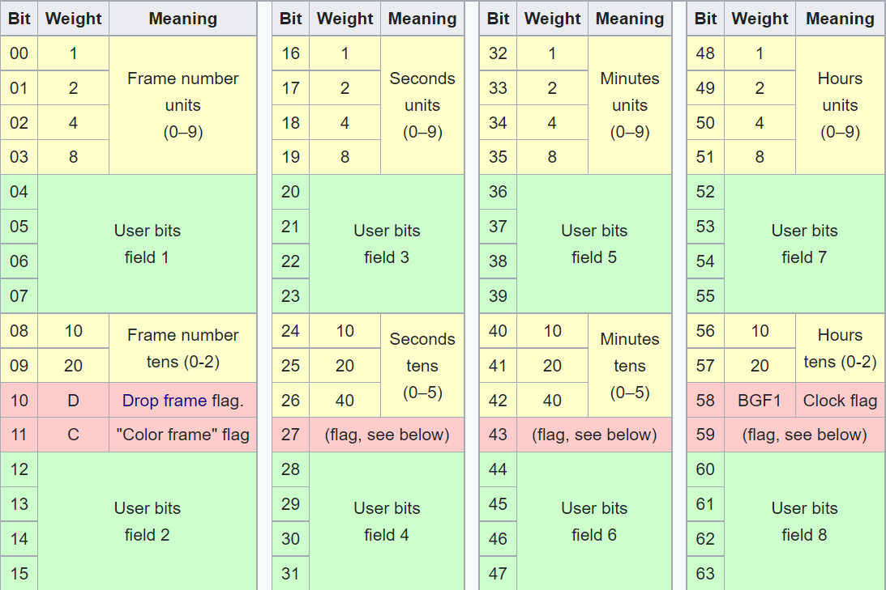
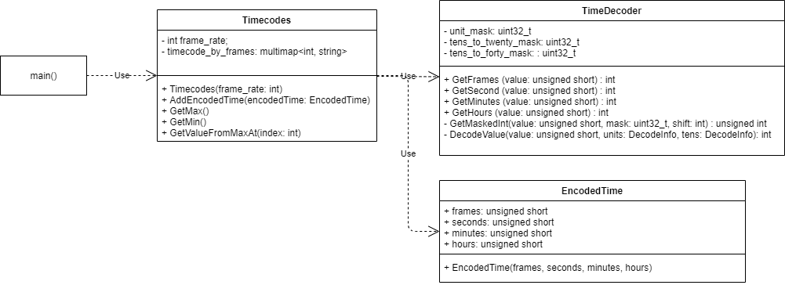

# Linear Timecode Decoder
  
“The basic format is an 80-bit code that gives the time of day to the second, and the frame number within the second. Values are stored in binary-coded decimal, least significant bit first. There are thirty-two bits of user data, usually used for a reel number and date.”

This project decodes 16 bit unsigned integers that represent a section in the timecode structure.

# Diagram

# References
https://en.wikipedia.org/wiki/Linear_timecode
